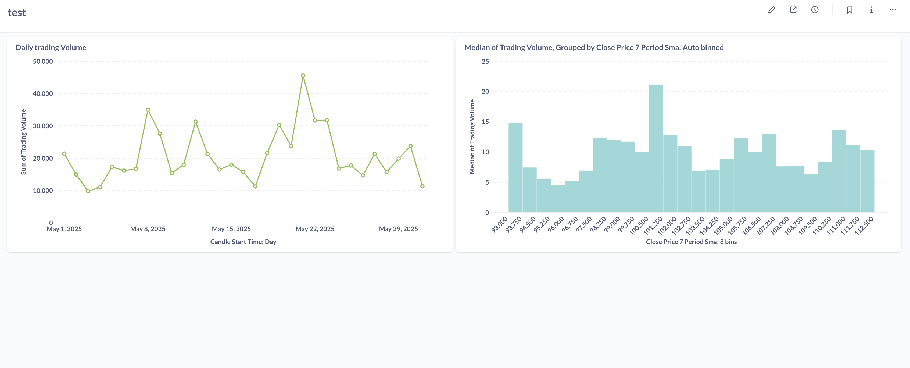

Digital Asset Analytics Platform

# Digital Asset Analytics Platform


*(This is the final metabase BI dashboard sample built on the processed data)*


1. Project Objective

This project is an end-to-end data engineering pipeline designed to handle high-frequency cryptocurrency data. The system architecture is built to be scalable for any digital asset, and this specific implementation processes approximately 9 GB dataset of raw BTCUSDT trades of may 2025 to demonstrate its capabilities. The goal is to transform this massive raw dataset into clean, aggregated, and valuable analytical models ready for business intelligence.

This portfolio piece demonstrates skills in cloud infrastructure management, large-scale data processing, data warehousing, and workflow orchestration.


### 2. Project Status

* [x] **Phase 1: Foundation & Ingestion**
    * [x] Infrastructure (S3 Data Lake) provisioned using Terraform.
    * [x] Ingestion script created in Python with Boto3.
    * [x] 9 GB of raw BTC trade data successfully uploaded to the S3 `raw/` layer.
* [x] **Phase 2: Data Processing & Transformation**
    * [x] Databricks environment configured and connected to the AWS account.
    * [x] Raw trade data read and processed using a Databricks Notebook with PySpark.
    * [x] Data aggregated from individual trades into 1-minute OHLCV candles.
    * [x] Processed data successfully saved to the S3 `processed/` layer in Parquet format.
* [x] **Phase 3: Warehousing & Modeling**
    * [x] Snowflake environment configured (Warehouse, Database, Roles).
    * [x] Secure connection between Snowflake and S3 created via a Storage Integration.
    * [x] Processed Parquet data from S3 loaded into a raw Snowflake table.
    * [x] dbt project initialized and connected to Snowflake.
    * [x] Data models (staging and marts) built to clean data and add business logic (e.g., moving averages).
    * [x] Data quality tests added and passed to ensure model integrity.
* [x] **Phase 4: Orchestration & Automation**
    * [x] Local Airflow environment configured using official Docker Compose.
    * [x] Connections to Databricks and Snowflake created and verified.
    * [x] A complete DAG written to orchestrate the entire pipeline from Databricks processing to dbt tests.
    * [x] Full end-to-end pipeline successfully executed via the Airflow DAG.
* [ ] **Phase 5: Visualization**
    * *(Upcoming)* Connect Metabase to Snowflake to create analytical dashboards.


### 3. Tech Stack
| Category          | Technology                 | Purpose                                           |
| :---------------- | :------------------------- | :------------------------------------------------ |
| **Cloud Provider**| AWS                        | Hosting all cloud infrastructure.                 |
| **Data Lake** | AWS S3                     | Storage for raw and processed data files.         |
| **IaC** | Terraform                  | Provisioning and managing AWS resources as code.  |
| **Ingestion** | Python, Boto3              | Scripting the upload of source data to S3.        |
| **Data Processing** | Databricks, Apache Spark   | Large-scale transformation of the raw data.       |
| **Data Warehouse**| Snowflake                  |  Storing structured data for BI.      |
| **Data Modeling** | dbt                        |  Transforming data within the warehouse.|
| **Orchestration** | Apache Airflow             | *(Upcoming)* Automating and scheduling the pipeline.|
| **Containerization**| Docker                     | Running Airflow in a consistent environment.      |
| **Visualization** | Metabase                   | *(Upcoming)* Building BI dashboards.              |
| **Data Formats** | CSV, Parquet               | I/O formats for raw and processed data.           |


### 4. Data Pipeline Architecture (Current)

The architecture covers the full ELT (Extract, Load, Transform) process, from raw data ingestion to a tested analytical model in the data warehouse.
Itepresents a complete, automated ELT pipeline orchestrated by Apache Airflow.
[Local CSV] -> [Python] -> [S3 Raw Zone] -> [Databricks/Spark] -> [S3 Processed Zone] -> [Snowflake Stage] -> [COPY INTO] -> [Snowflake Raw Table] -> [dbt] -> [Snowflake Final Marts]


### 2. Project Status

* [x] **Phase 1: Foundation & Ingestion**
    * [x] Infrastructure (S3 Data Lake) provisioned using Terraform.
    * [x] Ingestion script created in Python with Boto3.
    * [x] 9 GB of raw BTC trade data successfully uploaded to the S3 `raw/` layer.
* [x] **Phase 2: Data Processing & Transformation**
    * [x] Databricks environment configured and connected to the AWS account.
    * [x] Raw trade data read and processed using a Databricks Notebook with PySpark.
    * [x] Data aggregated from individual trades into 1-minute OHLCV candles.
    * [x] Processed data successfully saved to the S3 `processed/` layer in Parquet format.
* [x] **Phase 3: Warehousing & Modeling**
    * [x] Snowflake environment configured (Warehouse, Database, Roles).
    * [x] Secure connection between Snowflake and S3 created via a Storage Integration.
    * [x] Processed Parquet data from S3 loaded into a raw Snowflake table.
    * [x] dbt project initialized and connected to Snowflake.
    * [x] Data models (staging and marts) built to clean data and add business logic.
    * [x] Data quality tests added and passed to ensure model integrity.
* [x] **Phase 4: Orchestration & Automation**
    * [x] Local Airflow environment configured using official Docker Compose.
    * [x] Connections to Databricks and Snowflake created and verified.
    * [x] A complete DAG written to orchestrate the entire pipeline from Databricks processing to dbt tests.
    * [x] Full end-to-end pipeline successfully executed via the Airflow DAG.
* [ ] **Phase 5: Visualization**
    * *(Next)* Connect Metabase to Snowflake to create an analytical dashboard.

### 4. Data Pipeline Architecture

The architecture represents a complete, automated ELT pipeline orchestrated by Apache Airflow.

<pre>
```
                 +------------------------------+
                 |     Apache Airflow (DAG)     |
                 |         (Orchestrator)       |
                 +--------------+---------------+
                                |
                   Triggers Databricks Job
                                |
                                V
                 +------------------------------+
                 |     Databricks (PySpark)     |
                 |     (Process Raw Data)       |
                 +--------------+---------------+
                                |
       Reads from S3 (raw) <----+----> Writes to S3 (processed)
                                |
                                V
                   Triggers dbt Core Commands
                                |
                                V
                 +------------------------------+
                 |          dbt Core            |
                 | (Models & Tests data in DW)  |
                 +--------------+---------------+
                                |
     Reads from/Writes to Snowflake Data Warehouse
```
</pre>


1.  **Orchestration:** An Airflow DAG (`daap_elt_pipeline`) defines the entire workflow, dependencies, and schedule.
2.  **Processing:** The first task triggers a Databricks notebook job. This job reads the raw CSV from the S3 `raw/` zone, processes it with Spark into 1-minute candles, and writes the result back to the S3 `processed/` zone as Parquet files.
3.  **Warehousing & Modeling:** After the Databricks job succeeds, subsequent Airflow tasks execute `dbt run` and `dbt test`. dbt connects to Snowflake, loads the data from the S3 stage into a raw table, and then runs a series of SQL models to transform the data into a final, tested analytics table.

### 5. Repository Structure

<pre>
```
── analytics/                    # dbt project for data modeling and transformation
│   ├── models/
│   │   └── ... (sources, staging, and mart models)
│   └── dbt_project.yml
│
├── dags/                         # Contains Airflow DAG file
│   └── daap_elt_pipeline.py
│
├── notebooks/
│   └── ... (Databricks .ipynb and .py files)
│
├── plugins/                      # For custom Airflow plugins (if any)
│
├── snowflake_setup/              # One-time SQL scripts for Snowflake setup
│   └── ... (*.sql files)
│
├── terraform/
│   └── main.tf
│
├── .gitignore                    # Specifies files for Git to ignore (e.g., .env, logs/)
├── docker-compose.yaml           # Defines and configures all Airflow services
├── ingestion.py                  # Script to upload raw data to S3
├── requirements.txt              # Python packages for the Airflow environment
└── README.md                     # This file
```
</pre>

